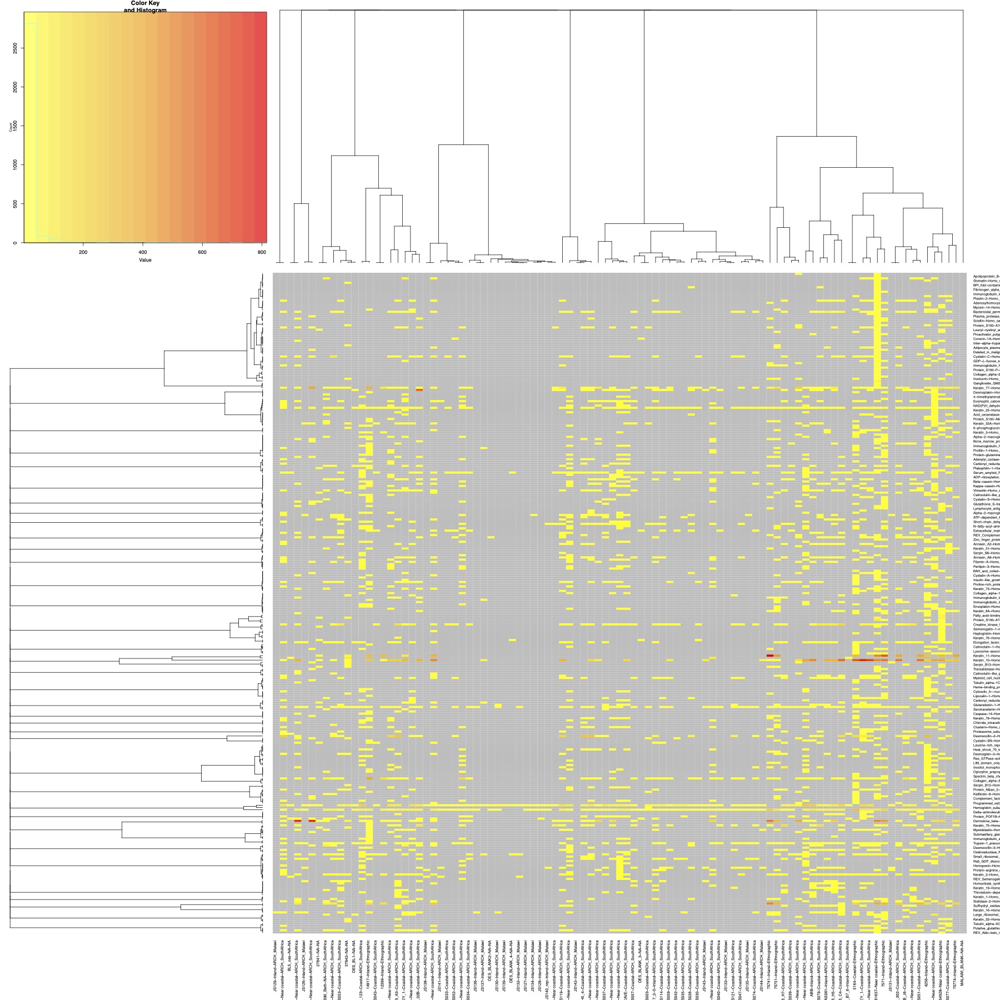

# p27048_SummarizedHeatmap
In this repository we are generating  heatmaps (w many NAs) and multiple row and col side colors

Here the raw  matrix as heatmap without row and colside colors

The tricky part is to handle NAs and  still have good col and row side color options

 

In order to use the heatmap.plus (it can handle the NAs) package  I included in this repository.
You  may  need to install it from commandline.

Use the terminal to navigate to the place where you the ```heatmap.plus_1.3.tar.gz``` file is.
